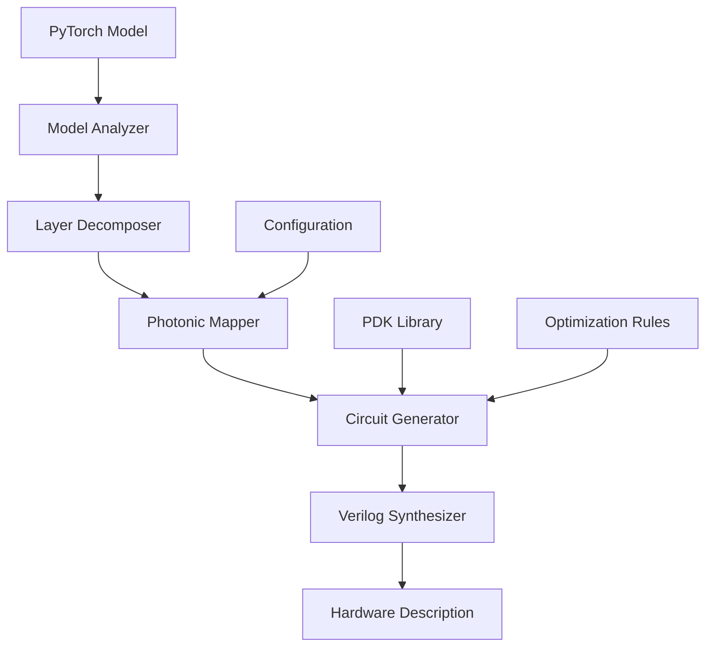
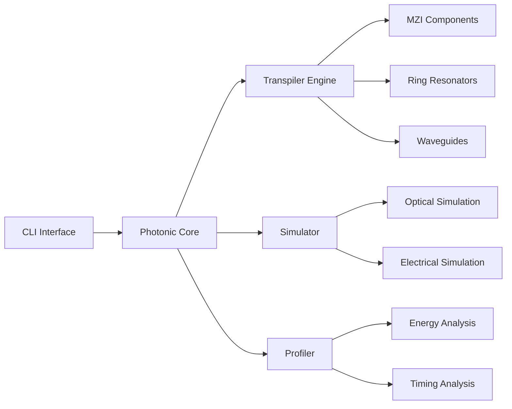

# Architecture Documentation

## Overview

Photonic-nn-foundry is a Python-based framework for developing and deploying silicon-photonic neural network accelerators. The architecture follows a modular design with clear separation of concerns.

## System Architecture

```
┌─────────────────────────────────────────────────────────┐
│                  CLI Interface (Click)                  │
├─────────────────────────────────────────────────────────┤
│                 Core Framework Layer                    │
│  ┌─────────────┐  ┌─────────────┐  ┌─────────────┐    │
│  │   Model     │  │  Photonic   │  │ Transpiler  │    │
│  │   Parser    │  │    Core     │  │   Engine    │    │
│  └─────────────┘  └─────────────┘  └─────────────┘    │
├─────────────────────────────────────────────────────────┤
│                Hardware Abstraction Layer               │
│  ┌─────────────┐  ┌─────────────┐  ┌─────────────┐    │
│  │  Photonic   │  │   Memory    │  │ Compute     │    │
│  │  Circuits   │  │ Management  │  │  Units      │    │
│  └─────────────┘  └─────────────┘  └─────────────┘    │
├─────────────────────────────────────────────────────────┤
│                   Output Generation                     │
│  ┌─────────────┐  ┌─────────────┐  ┌─────────────┐    │
│  │   Verilog   │  │ Test Bench  │  │   FPGA      │    │
│  │ Generation  │  │ Generation  │  │  Bitstream  │    │
│  └─────────────┘  └─────────────┘  └─────────────┘    │
└─────────────────────────────────────────────────────────┘
```

## Component Architecture

### 1. CLI Interface (`cli.py`)

**Purpose**: Command-line interface for user interactions

**Responsibilities**:
- Command parsing and validation
- User input/output handling
- Error reporting and logging
- Configuration management

**Key Components**:
```python
@click.group()
def cli():
    """Main CLI entry point"""

@cli.command()
def convert(model_path: str, output_dir: str):
    """Convert PyTorch model to photonic hardware"""

@cli.command()
def simulate(config_path: str):
    """Simulate photonic neural network"""
```

### 2. Core Framework (`core.py`)

**Purpose**: Central orchestration and business logic

**Responsibilities**:
- Model loading and validation
- Photonic circuit design
- Resource allocation and optimization
- Integration between components

**Key Classes**:
```python
class PhotonicCore:
    """Central coordinator for photonic neural networks"""
    
    def __init__(self, config: Dict):
        self.config = config
        self.transpiler = PhotonicTranspiler()
        self.optimizer = CircuitOptimizer()
    
    def process_model(self, model: torch.nn.Module) -> PhotonicCircuit:
        """Convert PyTorch model to photonic circuit"""
        
    def simulate(self, circuit: PhotonicCircuit) -> SimulationResults:
        """Simulate photonic circuit behavior"""
```

### 3. Transpiler Engine (`transpiler.py`)

**Purpose**: Convert PyTorch models to photonic hardware descriptions

**Responsibilities**:
- Neural network layer analysis
- Photonic component mapping
- Hardware description language generation
- Optimization pass management

**Key Classes**:
```python
class PhotonicTranspiler:
    """Converts neural networks to photonic circuits"""
    
    def transpile(self, model: torch.nn.Module) -> str:
        """Generate Verilog from PyTorch model"""
    
    def optimize_circuit(self, circuit: Circuit) -> Circuit:
        """Apply circuit-level optimizations"""
```

## Data Flow Architecture

### 1. Model Processing Pipeline

```
PyTorch Model → Model Parser → Layer Analysis → Photonic Mapping → Circuit Generation → Verilog Output
      ↓              ↓              ↓               ↓                ↓               ↓
   Validation → Type Checking → Resource → Component → Optimization → Testing
                                Planning    Selection
```

### 2. Configuration Flow

```
CLI Args → Config Validation → Parameter Resolution → Component Configuration → Execution
    ↓           ↓                    ↓                      ↓                  ↓
User Input → Schema Check → Default Merging → Object Creation → Processing
```

## Module Dependencies

### Internal Dependencies

```
cli.py
├── core.py
│   ├── transpiler.py
│   └── utils/
│       ├── validators.py
│       ├── optimizers.py
│       └── generators.py
└── config/
    ├── settings.py
    └── schemas.py
```

### External Dependencies

```
Core Framework:
├── PyTorch (>= 2.0.0)    # Neural network framework
├── NumPy (>= 1.21.0)     # Numerical computing
├── Pydantic (>= 2.0.0)   # Data validation
└── Click (>= 8.0.0)      # CLI framework

Development:
├── pytest (>= 7.0.0)     # Testing framework
├── black (>= 23.0.0)     # Code formatting
├── mypy (>= 1.0.0)       # Type checking
└── pre-commit            # Git hooks
```

## Design Patterns

### 1. Strategy Pattern

Used for different photonic component implementations:

```python
class PhotonicLayer(ABC):
    @abstractmethod
    def generate_verilog(self) -> str:
        pass

class MZILayer(PhotonicLayer):
    def generate_verilog(self) -> str:
        return "// MZI implementation"

class RingResonatorLayer(PhotonicLayer):
    def generate_verilog(self) -> str:
        return "// Ring resonator implementation"
```

### 2. Factory Pattern

For creating photonic components based on neural network layers:

```python
class PhotonicComponentFactory:
    @staticmethod
    def create_component(layer_type: str) -> PhotonicLayer:
        if layer_type == "Linear":
            return MZILayer()
        elif layer_type == "Conv2d":
            return PhotonicConvLayer()
        else:
            raise ValueError(f"Unsupported layer: {layer_type}")
```

### 3. Builder Pattern

For complex photonic circuit construction:

```python
class CircuitBuilder:
    def __init__(self):
        self.circuit = PhotonicCircuit()
    
    def add_input_layer(self, size: int) -> 'CircuitBuilder':
        self.circuit.add_layer(InputLayer(size))
        return self
    
    def add_mzi_layer(self, config: Dict) -> 'CircuitBuilder':
        self.circuit.add_layer(MZILayer(config))
        return self
    
    def build(self) -> PhotonicCircuit:
        return self.circuit
```

## Error Handling Architecture

### 1. Exception Hierarchy

```python
class PhotonicFoundryError(Exception):
    """Base exception for all photonic foundry errors"""

class ModelValidationError(PhotonicFoundryError):
    """Raised when model validation fails"""

class TranspilerError(PhotonicFoundryError):
    """Raised during transpilation process"""

class CircuitOptimizationError(PhotonicFoundryError):
    """Raised during circuit optimization"""

class HardwareConstraintError(PhotonicFoundryError):
    """Raised when hardware constraints are violated"""
```

### 2. Error Propagation

```
User Input → Validation → Processing → Output Generation
     ↓           ↓           ↓            ↓
Error Catch → Log Error → Cleanup → User Feedback
```

## Performance Architecture

### 1. Optimization Strategies

- **Lazy Loading**: Load models and configurations on-demand
- **Caching**: Cache transpilation results for repeated operations
- **Parallel Processing**: Utilize multi-core processing for large models
- **Memory Management**: Efficient memory usage for large neural networks

### 2. Profiling Points

```python
import time
from functools import wraps

def profile_performance(func):
    @wraps(func)
    def wrapper(*args, **kwargs):
        start_time = time.time()
        result = func(*args, **kwargs)
        end_time = time.time()
        print(f"{func.__name__} took {end_time - start_time:.2f} seconds")
        return result
    return wrapper
```

## Security Architecture

### 1. Input Validation

- **Schema Validation**: Use Pydantic for strict input validation
- **Path Sanitization**: Validate file paths to prevent directory traversal
- **Resource Limits**: Implement limits on model size and complexity

### 2. Secure Defaults

```python
DEFAULT_CONFIG = {
    "max_model_size_mb": 100,
    "max_layers": 1000,
    "allowed_layer_types": ["Linear", "Conv2d", "ReLU", "BatchNorm2d"],
    "output_sanitization": True,
}
```

## Testing Architecture

### 1. Test Structure

```
tests/
├── unit/                 # Component-level tests
│   ├── test_core.py
│   ├── test_cli.py
│   └── test_transpiler.py
├── integration/          # System-level tests
│   ├── test_workflows.py
│   └── test_end_to_end.py
└── fixtures/            # Test data and utilities
    ├── models/
    └── configs/
```

### 2. Test Categories

- **Unit Tests**: Test individual functions and classes
- **Integration Tests**: Test component interactions
- **Performance Tests**: Benchmark critical paths
- **Security Tests**: Validate input handling and security measures

## Deployment Architecture

### 1. Container Structure

```dockerfile
# Multi-stage build for different deployment targets
FROM python:3.10-slim as base
# Base dependencies and common setup

FROM base as development
# Development tools and debugging capabilities

FROM base as production
# Minimal production environment

FROM base as testing
# Testing tools and test data
```

### 2. Configuration Management

- **Environment Variables**: Runtime configuration
- **Config Files**: Static configuration and defaults
- **CLI Arguments**: User-specific overrides

## Extension Points

### 1. Plugin Architecture

```python
class PhotonicPlugin(ABC):
    @abstractmethod
    def register_components(self) -> List[PhotonicComponent]:
        pass
    
    @abstractmethod
    def get_name(self) -> str:
        pass
```

### 2. Custom Layer Support

```python
def register_custom_layer(layer_name: str, implementation: Type[PhotonicLayer]):
    """Register custom photonic layer implementation"""
    PhotonicComponentFactory.register(layer_name, implementation)
```

## Monitoring and Observability

### 1. Logging Architecture

```python
import logging

# Structured logging with context
logger = logging.getLogger(__name__)

def log_operation(operation: str, context: Dict):
    logger.info(f"Operation: {operation}", extra={"context": context})
```

### 2. Metrics Collection

- **Performance Metrics**: Execution time, memory usage
- **Usage Metrics**: Command frequency, model types
- **Error Metrics**: Error rates, error types

## Data Flow Diagrams

### Model Processing Data Flow



### System Component Interactions



This architecture provides a solid foundation for the photonic neural network framework while maintaining flexibility for future enhancements and extensions.